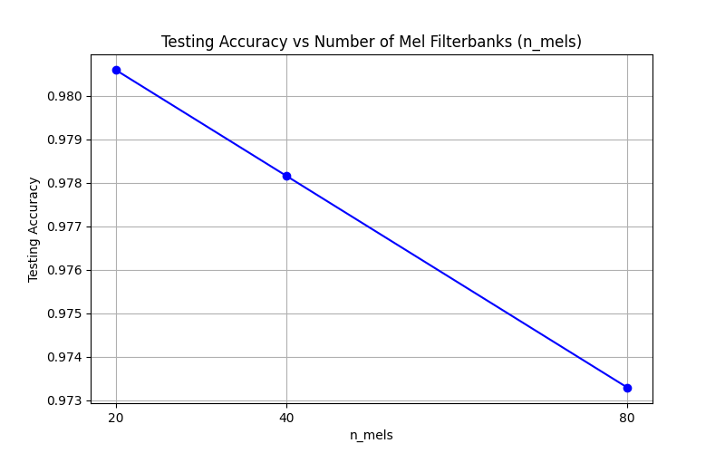
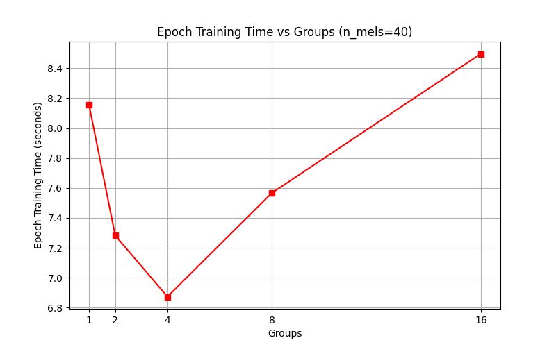
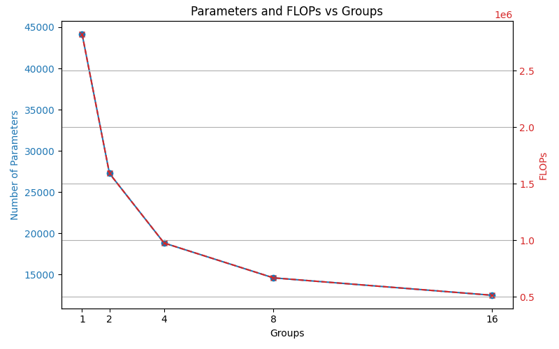

# Assignment 1: Digital Signal Processing
*Report for Digital Signal Processing / Отчет по цифровой обработке сигналов*

## 1. LogMelFilterBanks Implementation / Реализация LogMelFilterBanks
### [EN]
The `LogMelFilterBanks` layer was successfully implemented using PyTorch foundational operations (`torch.stft`, `torch.matmul`, `torch.log`). The validation against the native `torchaudio.transforms.MelSpectrogram` confirmed that the shape and numerical output are identical (`torch.allclose` passed).

### [RU]
Слой `LogMelFilterBanks` был успешно реализован с использованием базовых операций PyTorch (`torch.stft`, `torch.matmul`, `torch.log`). Проверка по отношению к нативной реализации `torchaudio.transforms.MelSpectrogram` показала идентичность форматов и численных значений (`torch.allclose` пройдена успешно).

---

## 2. CNN Training: Varying Filterbanks (n_mels) / Обучение CNN: Изменение количества фильтров (n_mels)
### [EN]
A basic 1D Convolutional Neural Network (under 100K parameters) was built to classify `YES` and `NO` classes from the Google Speech Commands dataset. The first experiment varied `n_mels` across [20, 40, 80].
- **Results**: Changing `n_mels` had a very minor impact on testing accuracy after 2 epochs, maintaining ~97-98% across all choices. The configuration `n_mels = 40` was taken as a baseline for the next stage.
- **Plot**:

### [RU]
Базовая одномерная сверточная нейросеть (Convolutional Neural Network) объемом менее 100 000 параметров была построена для бинарной классификации команд `YES` (да) и `NO` (нет) на датасете Google Speech Commands. В первом эксперименте изменялось количество мел-фильтров `n_mels` (20, 40, 80).
- **Результаты**: Изменение `n_mels` оказало незначительное влияние на точность классификации на тестовой выборке (Test Accuracy) после 2-х эпох; во всех случаях точность оставалась на уровне ~97-98%. Значение `n_mels = 40` было выбрано как базовое для следующего этапа.
- **График**:

---

## 3. CNN Training: Varying Conv1d Groups / Обучение CNN: Изменение групп в Conv1d 
### [EN]
The `groups` parameter in `torch.nn.Conv1d` layers was varied through [2, 4, 8, 16] using `n_mels=40` as a baseline reference. 
- **Time Performance**: The training time per epoch fluctuated minimally (~7-8.5 seconds on CPU), showing no strict correlation during a lightweight training procedure, though highly grouped convolutions can sometimes map less efficiently on dense kernels.
- **Model Efficiency (Params & FLOPs)**: Increasing the `groups` parameter drastically reduced the number of trainable parameters and FLOPs. A `group=16` model required roughly ~70% fewer parameters (~12.5k compared to ~44k) while still achieving over 96.5% test accuracy.
- **Plots**:

### [RU]
На этом этапе параметр `groups` в слоях `torch.nn.Conv1d` изменялся в диапазоне [2, 4, 8, 16], используя ранее выбранное базовое значение `n_mels=40`.
- **Время обучения**: Время обучения одной эпохи варьировалось минимально (около ~7-8.5 секунд при вычислениях на CPU) и не показало строгой зависимости. 
- **Эффективность модели (Параметры и FLOPs)**: Увеличение частоты групп значительно сократило количество параметров модели и число операций с плавающей запятой (FLOPs). Модель со значением `groups=16` требовала на ~70% меньше параметров (~12.5k вместо ~44k) и демонстрировала точность на тестовой выборке свыше 96.5%.
- **Графики**:

